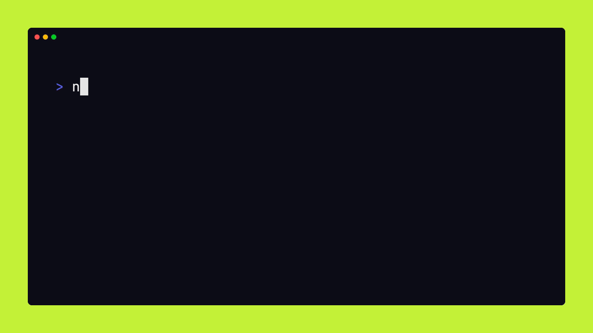

<div align="center">
<h1>☀️ Create CXX</h1>
<h6>Set up a modern C++ project blazingly fast!</h6>

[](https://github.com/painfulexistence/create-cxx/actions/workflows/ci.yml) [](https://github.com/painfulexistence/create-cxx/blob/main/LICENSE) [](https://www.npmjs.com/package/create-cxx)
</div>

</img>

This is a Node.js script that can help you quickly spin up a new C++ project with a basic structure and essential files <br/>

## Usage
#### NPM
```bash
npm create cxx $PROJECT_NAME
# or
npx create-cxx $PROJECT_NAME
```
#### PNPM
```bash
pnpm create cxx $PROJECT_NAME
# or
pnpm dlx create-cxx $PROJECT_NAME
```
#### Bun
```bash
bun create cxx $PROJECT_NAME
# or
bunx create-cxx $PROJECT_NAME
```

## Contributing
The project leverages <a href="https://bun.sh/">Bun</a>, so ensure Bun is installed before proceeding
